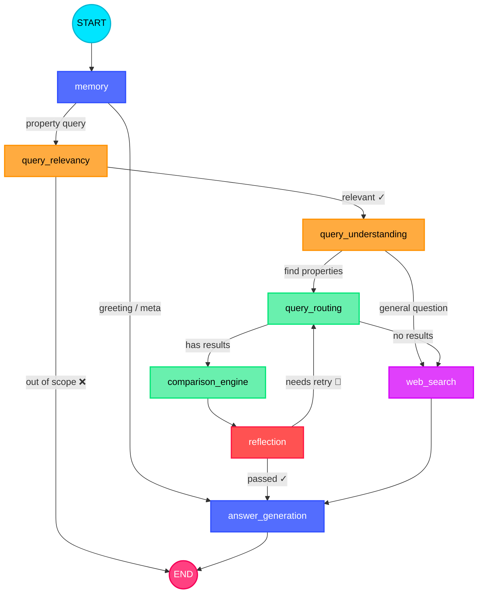

# 🏠 Agentic Property — Dubai Real Estate AI Agent

<p align="center">
  
</p>

<p align="center">
  <b>An 8-node LangGraph agent that answers Dubai real estate questions — routes queries through a dual-path pipeline (property search over 1.5M+ DLD transactions or web search), scores listings against user criteria, audits its own output with a self-correcting retry loop, and streams answers token-by-token through a Streamlit UI.</b>
</p>

<p align="center">
  <a href="#"></a>
  <a href="#"></a>
  <a href="#"></a>
  <a href="#"></a>
  <a href="#"></a>
  <a href="#"></a>
  <a href="#"></a>
  <a href="#"></a>
  <a href="#"></a>
</p>

---

## Architecture



---
## Node Responsibilities

| # | Node | What it does |
|---|------|-------------|
| 1 | **memory** | Builds conversation context, classifies every message as greeting / meta-question / property query. Short-circuits greetings directly to answer. |
| 2 | **query_relevancy** | First gate: is it about Dubai? Is it about property? Rejects out-of-scope queries immediately. |
| 3 | **query_understanding** | Parses the user's intent into structured criteria (location, budget, bedrooms, etc.) and decides the route: property search or general web Q&A. |
| 4 | **query_routing** | Fetches properties from the DLD MCP server. Tier 1: active listings → Tier 2: historical transactions. Handles currency conversion to AED. |
| 5 | **web_search** | Sub-graph: searches the web via DuckDuckGo, then summarizes results with an LLM. Used for general questions and as fallback when no properties match. |
| 6 | **comparison_engine** | Scores each retrieved property against the user's criteria (fit score, matched/unmatched criteria, price assessment). |
| 7 | **reflection** | Quality audit: checks comparison output for accuracy and completeness. Can trigger a retry back to query_routing (up to `max_retries`). |
| 8 | **answer_generation** | Single convergence point for all paths. Generates the final user response — recommendation, market insights, general answer, or greeting. |

## Graph Topology

```
START
  │
  ▼
memory ───────────────────────────────────────────────┐
  │ (property query)                                  │ (greeting / meta)
  ▼                                                   │
query_relevancy ──❌ out of scope──► END              │
  │ ✓                                                 │
  ▼                                                   │
query_understanding                                   │
  ├── "query_routing" ──► query_routing               │
  │                         ├── has results           │
  │                         │    ▼                    │
  │                         │  comparison_engine      │
  │                         │    ▼                    │
  │                         │  reflection             │
  │                         │    ├── passed ✓ ────────┤
  │                         │    └── retry 🔄 ────────┘ (back to query_routing)
  │                         │                         │
  │                         └── no results ──┐        │
  │                                          │        │
  └── "web_search" ──► web_search ◄─────────┘         │
                            │                         │
                            ▼                         │
                     answer_generation ◄──────────────┘
                            │
                            ▼
                           END
```

## Key Design Decisions

- **Single state object** (`AgentState` Pydantic model) flows through every node. No hidden channels, no side-band communication.
- **Dual-path topology**: property search (query_routing → comparison → reflection) and web search (DuckDuckGo → LLM summary) are parallel paths that converge at answer_generation.
- **Retry loop**: reflection → query_routing retries with the next tool tier when comparison quality is insufficient (max 3 by default).
- **Fail-safe everywhere**: every LLM call has a JSON parse fallback. Relevancy defaults to "allow" on parse failure (don't block valid users). Understanding defaults to web_search.
- **Currency conversion**: user-specified currencies (USD, EUR, GBP, etc.) are converted to AED before querying DLD data.

## Tech Stack

- **Framework**: LangGraph (StateGraph with conditional edges)
- **LLM**: Configurable via `src/llm/factory.py` (supports any LangChain-compatible model: Ollama, vLLM, Groq, custom endpoints)
- **Data**: DLD (Dubai Land Department) via MCP server & PostgreSQL (running via Docker)
- **Web Search**: DuckDuckGo (ddgs) + LLM summarization
- **Persistence**: SqliteSaver (LangGraph checkpointer) for conversation state (stored in `data/memory/chat_history.db`)
- **Flagship UI**: React/Vite agentic workspace with property intelligence drawer, trace, map, and comparison tray
- **Legacy POC UI**: Streamlit with streaming token-by-token output and Light/Dark modes
- **Validation**: Pydantic v2 (AgentState + settings)
- **Evaluation**: LangSmith for structural and quality assurance testing

## Project Structure

```
Agentic-Property/
├── main.py                     # Streamlit chat UI
├── README.md
├── architecture.html           # Interactive graph visualization
├── pyproject.toml
├── .env.example                # Template for environment variables
├── config/
│   └── pydantic/
│       └── settings.py         # Pydantic Settings (max_retries, LLM config, etc.)
├── data/                       # Application data & persistent storage (chat history, CSVs)
├── docker/                     # Dockerfile and docker-compose for data services
├── frontend/                   # Flagship React/Vite interface
├── src/
│   ├── agents/
│   │   ├── graph.py            # LangGraph StateGraph definition
│   │   └── state.py            # AgentState Pydantic model
│   ├── nodes/
│   │   ├── memory.py           # Conversation context + query classification
│   │   ├── query_relevancy.py  # Dubai + property scope gate
│   │   ├── query_understanding.py  # Intent parsing + route decision
│   │   ├── query_routing.py    # DLD property fetching (active → historical)
│   │   ├── web_search.py       # DuckDuckGo search sub-graph
│   │   ├── comparison_engine.py    # Property scoring against criteria
│   │   ├── reflection.py       # Quality audit + retry trigger
│   │   └── answer_generation.py    # Final response for all paths
│   ├── llm/
│   │   └── factory.py          # LLM provider abstraction
│   ├── memory/
│   │   └── long_term_memory.py # SqliteSaver checkpointer
│   ├── mcp/
│   │   ├── client.py           # DLD MCP server client
│   │   ├── server.py           # FastMCP server
│   │   └── schemas.py          # Tool schemas
│   ├── data_service/           # FastAPI property data service
│   ├── prompts/                # YAML prompt templates
│   ├── tools/                  # Tool definitions
│   └── utils.py                # parse_llm_json, etc.
├── tests/
│   ├── agents/                 # Graph + E2E tests
│   └── nodes/                  # Per-node unit tests
└── scripts/
    ├── run_cli.py              # CLI invocation
    ├── scraper.py              # Data scraping
    ├── run_data_service.py     # Data service launcher (seeds DB automatically)
    ├── upload_eval_datasets.py # Script for syncing eval datasets to LangSmith
    └── run_langsmith_eval.py   # LangSmith evaluations (structural & quality)
```

## Setup & Configuration

1. **Environment Variables**:
   Copy the example environment file and configure your API keys (e.g., Groq, LangSmith, OpenAI, etc.):
   ```bash
   cp .env.example .env
   ```

2. **Install Dependencies**:
   The project uses [uv](https://github.com/astral-sh/uv) for fast package management.
   ```bash
   uv sync
   ```

3. **Start the full application**:
   Set your local model settings in `.env`, ensure both CSV files exist under `data/`, then run:
   ```bash
   docker compose up --build -d
   ```
   Open [http://localhost:5173](http://localhost:5173). The first start backs up existing PostgreSQL and SQLite listing data under `data/backups/`, repairs SQLite from the CSVs, and seeds PostgreSQL. PostgreSQL is primary; SQLite is a visible fallback if PostgreSQL is unavailable.

## Usage

### Flagship Agentic UI (recommended)

The flagship UI is a buyer workspace backed by the active CSV dataset loaded into the database. It does not present demo listings or claim real-time scraping. Each result shows its source and dataset snapshot date; saved searches are kept only in the browser and are flagged when a newer active snapshot is returned.

Use the map as relative location evidence from supplied listing coordinates. It intentionally has no paid map dependency, and records without verified coordinates remain area-only. The comparison tray accepts one to four homes, and its decision sheet makes historical context and buyer-entered ownership costs explicit.

Buyers can add must-have, nice-to-have, and deal-breaker context to a brief, inspect reported price-per-square-foot, request historical area context, and leave browser-local research feedback. The data-service health endpoint reports active/historical record counts and the latest active snapshot date for operational visibility.

```bash
docker compose up --build -d
```

Open [http://localhost:5173](http://localhost:5173). The browser UI calls the agent facade at `http://localhost:8002`; the data service remains available at `http://localhost:8000`. Check service state with `docker compose logs -f`; stop with `docker compose down`.

The buyer workspace keeps research conversations in the existing LangGraph SQLite checkpoint store and restores the visible timeline through `GET /api/conversations/{thread_id}`. Its decision sheet requests factual historical context from `GET /api/market-context`, optionally narrowed by property type and bedrooms; this evidence is explicitly market context, not active inventory or a valuation.

### Web UI
Run the legacy Streamlit proof of concept:
```bash
uv run streamlit run main.py
```

### CLI Mode
Query the agent directly from the terminal without launching a web server:
```bash
uv run python scripts/run_cli.py "2-bedroom apartment in Dubai Marina under 2M AED"
```

## Evaluation (LangSmith)

We use LangSmith to run objective assertions and LLM-as-a-judge quality testing against the dual-path routing.
Make sure you have `LANGSMITH_API_KEY` set in your `.env`.

```bash
# Upload evaluation datasets
uv run python scripts/upload_eval_datasets.py

# Run both structural and quality evaluations
uv run python scripts/run_langsmith_eval.py

# Filter evaluations by type or tags
uv run python scripts/run_langsmith_eval.py --type structural
uv run python scripts/run_langsmith_eval.py --type quality --tag currency
```

## Running Tests

Execute the unit tests and end-to-end (E2E) tests via Pytest:
```bash
uv run pytest tests/ -v                       # 4 test suites (unit, graph, E2E, thread isolation)
```

## License

MIT — see [LICENSE](LICENSE).
