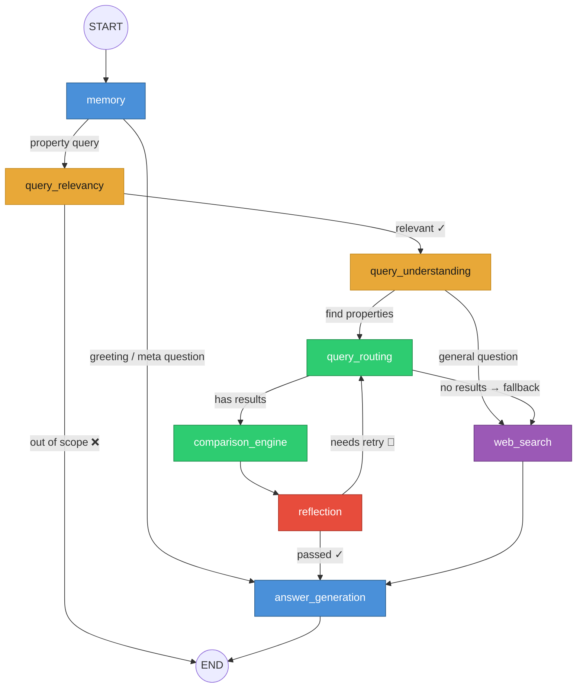

# 🏠 Agentic Property — Dubai Real Estate AI Assistant

A LangGraph-powered agent that answers questions about Dubai real estate — from property recommendations to market insights — using DLD (Dubai Land Department) data and web search.

## Architecture

The agent is built as a **LangGraph StateGraph** with 8 nodes, dual-path routing, and a retry loop. Every query flows through a pipeline of LLM-powered nodes, each with a single responsibility.



> For an interactive version with zoom, pan, and clickable node descriptions, open **[architecture.html](architecture.html)** in your browser.

## Node Responsibilities

| # | Node | What it does |
|---|------|-------------|
| 1 | **memory** | Builds conversation context, classifies every message as greeting / meta-question / property query. Short-circuits greetings directly to answer. |
| 2 | **query_relevancy** | First gate: is it about Dubai? Is it about property? Rejects out-of-scope queries immediately. |
| 3 | **query_understanding** | Parses the user's intent into structured criteria (location, budget, bedrooms, etc.) and decides the route: property search or general web Q&A. |
| 4 | **query_routing** | Fetches properties from the DLD MCP server. Tier 1: active listings → Tier 2: historical transactions. Handles currency conversion to AED. |
| 5 | **web_search** | Sub-graph: searches the web via DuckDuckGo, then summarizes results with an LLM. Used for general questions and as fallback when no properties match. |
| 6 | **comparison_engine** | Scores each retrieved property against the user's criteria (fit score, matched/unmatched criteria, price assessment). |
| 7 | **reflection** | Quality audit: checks comparison output for accuracy and completeness. Can trigger a retry back to query_routing (up to `max_retries`). |
| 8 | **answer_generation** | Single convergence point for all paths. Generates the final user response — recommendation, market insights, general answer, or greeting. |

## Graph Topology

```
START
  │
  ▼
memory ──────────────────────────────────────────────┐
  │ (property query)                                  │ (greeting / meta)
  ▼                                                   │
query_relevancy ──❌ out of scope──► END              │
  │ ✓                                                 │
  ▼                                                   │
query_understanding                                   │
  ├── "query_routing" ──► query_routing               │
  │                         ├── has results           │
  │                         │    ▼                    │
  │                         │  comparison_engine      │
  │                         │    ▼                    │
  │                         │  reflection             │
  │                         │    ├── passed ✓ ────────┤
  │                         │    └── retry 🔄 ────────┘ (back to query_routing)
  │                         │                         │
  │                         └── no results ──┐        │
  │                                          │        │
  └── "web_search" ──► web_search ◄─────────┘        │
                            │                         │
                            ▼                         │
                     answer_generation ◄──────────────┘
                            │
                            ▼
                           END
```

## Key Design Decisions

- **Single state object** (`AgentState` Pydantic model) flows through every node. No hidden channels, no side-band communication.
- **Dual-path topology**: property search (query_routing → comparison → reflection) and web search (DuckDuckGo → LLM summary) are parallel paths that converge at answer_generation.
- **Retry loop**: reflection → query_routing retries with the next tool tier when comparison quality is insufficient (max 3 by default).
- **Fail-safe everywhere**: every LLM call has a JSON parse fallback. Relevancy defaults to "allow" on parse failure (don't block valid users). Understanding defaults to web_search.
- **Currency conversion**: user-specified currencies (USD, EUR, GBP, etc.) are converted to AED before querying DLD data.

## Tech Stack

- **Framework**: LangGraph (StateGraph with conditional edges)
- **LLM**: Configurable via `src/llm/factory.py` (supports any LangChain-compatible model)
- **Data**: DLD (Dubai Land Department) via MCP server
- **Web Search**: DuckDuckGo (ddgs) + LLM summarization
- **Persistence**: SqliteSaver (LangGraph checkpointer) for conversation state
- **UI**: Streamlit with streaming token-by-token output
- **Validation**: Pydantic v2 (AgentState + settings)

## Project Structure

```
Agentic-Property/
├── main.py                     # Streamlit chat UI
├── README.md
├── architecture.html           # Interactive graph visualization
├── pyproject.toml
├── config/
│   └── pydantic/
│       └── settings.py         # Pydantic Settings (max_retries, LLM config, etc.)
├── src/
│   ├── agents/
│   │   ├── graph.py            # LangGraph StateGraph definition
│   │   └── state.py            # AgentState Pydantic model
│   ├── nodes/
│   │   ├── memory.py           # Conversation context + query classification
│   │   ├── query_relevancy.py  # Dubai + property scope gate
│   │   ├── query_understanding.py  # Intent parsing + route decision
│   │   ├── query_routing.py    # DLD property fetching (active → historical)
│   │   ├── web_search.py       # DuckDuckGo search sub-graph
│   │   ├── comparison_engine.py    # Property scoring against criteria
│   │   ├── reflection.py       # Quality audit + retry trigger
│   │   └── answer_generation.py    # Final response for all paths
│   ├── llm/
│   │   └── factory.py          # LLM provider abstraction
│   ├── memory/
│   │   └── long_term_memory.py # SqliteSaver checkpointer
│   ├── mcp/
│   │   ├── client.py           # DLD MCP server client
│   │   ├── server.py           # FastMCP server
│   │   └── schemas.py          # Tool schemas
│   ├── data_service/           # FastAPI property data service
│   ├── prompts/                # YAML prompt templates
│   ├── tools/                  # Tool definitions
│   └── utils.py                # parse_llm_json, etc.
├── tests/
│   ├── agents/                 # Graph + E2E tests
│   └── nodes/                  # Per-node unit tests
└── scripts/
    ├── run_cli.py              # CLI invocation
    ├── scraper.py              # Data scraping
    └── run_data_service.py     # Data service launcher
```

## Usage

```bash
# Install dependencies
uv sync

# Run the Streamlit UI
uv run streamlit run main.py

# Run tests
uv run pytest tests/ -v

# CLI mode
uv run python scripts/run_cli.py "2-bedroom apartment in Dubai Marina under 2M AED"
```
