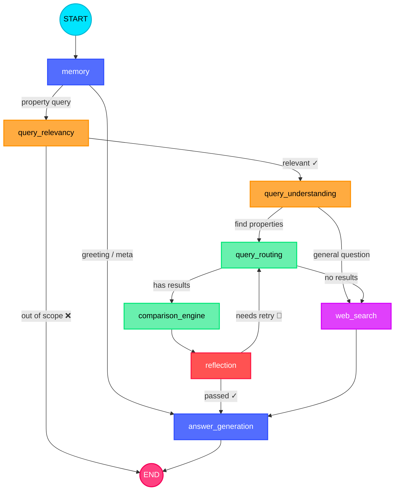

# 🏠 Agentic Property — Dubai Real Estate AI Agent

<p align="center">
  
</p>

<p align="center">
  <b>A LangGraph-powered agentic RAG system for Dubai real estate — property recommendations, market insights, and conversational search backed by 28K+ active listings and 1.5M+ historical DLD transactions.</b>
</p>

<p align="center">
  <a href="#-architecture"></a>
  <a href="#-tech-stack"></a>
  <a href="#-tech-stack"></a>
  <a href="#-evaluation"></a>
  <a href="https://github.com/Mahmoud-N-Elmallah/Agentic-Property/blob/main/LICENSE"></a>
</p>

---

## Architecture

The agent is an 8-node **LangGraph StateGraph** with dual-path routing, a self-correcting retry loop, web search fallback, and MCP-powered property data access. Every query flows through a pipeline of LLM-powered nodes, each with a single responsibility.



> For an **interactive version** with zoom, pan, clickable nodes, and neon glow effects, open **[architecture.html](architecture.html)** in your browser.

### Pipeline Flow

```
START
  │
  ▼
memory ────────────────────────────────────────┐
  │ (property query)                           │ (greeting / meta)
  ▼                                            │
query_relevancy ──❌ out of scope──► END       │
  │ ✓                                          │
  ▼                                            │
query_understanding                            │
  ├── "query_routing" ──► query_routing        │
  │                         ├── has results    │
  │                         │    ▼             │
  │                         │  comparison      │
  │                         │    ▼             │
  │                         │  reflection      │
  │                         │    ├── ✓ ────────┤
  │                         │    └── 🔄 ───────┘ (retry loop)
  │                         │                  │
  │                         └── no results ─┐  │
  │                                         │  │
  └── "web_search" ──► web_search ◄────────┘  │
                            │                  │
                            ▼                  │
                     answer_generation ◄───────┘
                            │
                            ▼
                           END
```

---

## Node-by-Node Breakdown

| # | Node | Color | What It Does |
|---|------|-------|-------------|
| 1 | **Memory** | 🔵 Blue | Entry gate. Builds conversation context from chat history. Classifies every query as `greeting`, `meta_question`, or `property_query`. Greetings short-circuit directly to answer generation — zero LLM calls wasted on the property pipeline. |
| 2 | **Query Relevancy** | 🟠 Orange | Scope gate. Two hard checks: (1) Is it about Dubai? (2) Is it about real estate? Rejects out-of-scope queries immediately with a warm explanation. Fail-safe: defaults to "allow" if LLM output is unparseable — never blocks a valid user. |
| 3 | **Query Understanding** | 🟠 Orange | Intent parser. Single LLM call does double duty: extracts structured criteria (location, budget, bedrooms, property type, currency...), AND decides the route — property search vs general web Q&A. Handles thinking-model output (strips `<think>` tags), retries on empty responses. |
| 4 | **Query Routing** | 🟢 Green | Data fetcher. Connects to the DLD MCP server. Two-tier strategy: **Tier 1** — active listings (live, recommendable). **Tier 2** — historical transactions (insights only, properties may be sold). Converts non-AED currencies before querying the DB. Falls back to web search when both tiers return empty. |
| 5 | **Web Search** | 🟣 Purple | Sub-graph with 3 internal nodes: query rewriting → DuckDuckGo search (with Tavily fallback) → LLM summarization. Used as primary path for general questions AND as fallback when no properties match. |
| 6 | **Comparison Engine** | 🟢 Green | Property scorer. Evaluates every retrieved property against user criteria. Outputs per-property: `fit_score` (0.0–1.0), matched/unmatched criteria, and `price_assessment` (below_market/fair/above_market). Caps at 5 properties for small-model reliability. |
| 7 | **Reflection** | 🔴 Red | Quality auditor. Audits the comparison engine's output — NOT raw data, NOT user intent. Asks: "Is this comparison accurate, complete, and internally consistent?" If audit fails, routes BACK to query_routing to try the next tool tier (max 3 retries). |
| 8 | **Answer Generation** | 🔵 Blue | Convergence point. Single node for ALL paths — property recommendations, market insights, general Q&A, greetings, meta-questions. The UI and CLI always read `final_answer` — one field, every path. |

---

## Key Engineering Decisions

### 1. Single State Object — No Side Channels

All state flows through a single `AgentState` Pydantic model (~25 fields). No hidden globals, no side-band communication between nodes. Every node reads from and writes to the same typed state. This makes the graph fully serializable, debug-friendly, and checkpointable by LangGraph's SqliteSaver.

### 2. Dual-Path Topology

The graph splits after query understanding into two independent paths that converge at answer generation:

- **Property search path**: `query_routing → comparison_engine → reflection → answer_generation`
- **Web search path**: `web_search → answer_generation`

The retry loop (`reflection → query_routing`) only exists on the property path. Web search is a one-shot operation.

### 3. Memory: Routing Leak Fix

The original implementation dumped all conversation history into every LLM prompt. This caused two problems:

- **Context window bloat**: 20-turn conversations overwhelmed small models (4B–8B params).
- **Routing leak**: stale `route` values from prior turns would leak into the next turn's conditional edges.

**The fix**: The Memory node runs FIRST in every turn and:

1. Truncates history to last 10 turns
2. Classifies every query as `greeting`, `meta_question`, or `property_query`
3. Explicitly sets `route = None` for property queries — stale decisions can never leak

```python
# memory.py — route always set fresh, never inherited from prior state
if category == "greeting":
    return {"conversation_context": context, "route": "memory_greeting"}
if category == "meta_question":
    return {"conversation_context": context, "route": "memory_direct"}
return {"conversation_context": context, "route": None}  # ← clears stale route
```

### 4. Self-Correcting Retry Loop

Most agent pipelines are linear: fetch → compare → answer. This one has a **self-correcting loop**. If the reflection node finds the comparison low-quality (hallucinated fit scores, missing criteria, inconsistent assessments), it routes back to query_routing to re-fetch with the next tool tier. Capped at `max_retries` (default 3).

### 5. Fail-Safe Everywhere

Every LLM call has a JSON parse fallback. Every node has a safe default:

| Node | Fallback on failure |
|------|-------------------|
| Memory | Defaults to `property_query` — let it through |
| Query Relevancy | Defaults to `is_relevant=True` — don't block valid users |
| Query Understanding | Defaults to `web_search` — safer than hallucinating a property search |
| Comparison Engine | Returns empty comparison with `_parse_error` field |
| Reflection | Defaults to `ok=False` with error message — triggers retry |
| Web Search | DuckDuckGo → Tavily fallback (separate API key) |

### 6. Currency Conversion Layer

Users can express budgets in any currency (USD, EUR, GBP, EGP, etc.). The query understanding node extracts the currency, and query routing converts prices to AED using real-time exchange rates from **exchangerate.host** — all before querying the DLD database. The answer generation node displays prices in both AED and the user's currency.

### 7. MCP Server for Property Data

The property data access layer is a standalone **MCP (Model Context Protocol) server** with three tools:

| Tool | Description |
|------|------------|
| `search_active_listings` | Current live properties (Bayut API, scraped daily) |
| `search_historical_listings` | 1.5M+ DLD transaction records |
| `convert_currency` | Real-time FX via exchangerate.host |

The MCP server talks to a **FastAPI data service** backed by SQLite (local dev) or PostgreSQL (Docker production). The MCP client auto-launches the server as a subprocess via **stdio** — no manual server startup needed.

```
User Query → LangGraph Agent → MCP Client (stdio subprocess) → MCP Server (FastMCP) → FastAPI Data Service → SQLite/PostgreSQL
```

The client uses a **persistent background thread + event loop** to maintain a singleton MCP session, avoiding per-call connection overhead. Three transport modes are supported: `stdio` (default, subprocess), `sse` (Server-Sent Events), and `streamable_http` (configurable via `config/mcp.yaml`).

### 8. Web Search Sub-Graph

The web search node is itself a compiled LangGraph sub-graph with 3 internal nodes:

1. **Query Rewriter**: Rewrites conversational queries into targeted search strings
2. **Searcher**: DuckDuckGo (primary) with automatic Tavily fallback
3. **Summarizer**: Condenses raw results into a coherent answer via LLM

This handles questions like "what are the best areas to invest in Dubai?" or "how does Dubai mortgage law work?"

### 9. Multi-Provider LLM Abstraction

The LLM layer is provider-agnostic. Switching providers = changing one env var (`LLM_PROVIDER`):

| Provider | Use Case |
|----------|----------|
| `groq` | Cloud — fast inference, default |
| `ollama` | Local dev — llama3.1, no API key needed |
| `vllm` | Production GPU server — OpenAI-compatible API |
| `custom_openai_compatible_endpoint` | Any endpoint (Unsloth Studio, llama.cpp server, etc.) |

The factory handles provider quirks: Groq reasoning tokens hidden during streaming, thinking-model output stripping, custom `enable_thinking` flags, etc.

### 10. Prompt Engineering System

All LLM prompts are stored as **YAML templates** in `src/prompts/` and loaded via `src/prompts/loader.py`. This separates prompt engineering from code — prompts can be iterated without touching Python files. Each prompt file serves one node:

| File | Node | Purpose |
|------|------|---------|
| `memory.yaml` | Memory | Query classification + context building |
| `query_relevancy.yaml` | Query Relevancy | Scope validation + rejection messages |
| `query_understanding.yaml` | Query Understanding | Intent extraction + route decision |
| `query_routing.yaml` | — | (param mapping, inline in code) |
| `web_search.yaml` | Web Search | Query rewriting + result summarization |
| `comparison_engine.yaml` | Comparison Engine | Recommend mode + insights-only mode |
| `reflection.yaml` | Reflection | Quality audit criteria |
| `answer_generation.yaml` | Answer Generation | 5 distinct prompt paths |

### 11. Database Fallback Chain

The data service automatically handles environment transitions:

```
DATABASE_URL set? ──yes──► Try connecting ──success──► Use it
                              │
                              └── fail ──► Fall back to SQLite (data/dld_local.db)
                                                 │
DATABASE_URL not set? ───────────────────────────┘
```

SQLite uses the exact same SQLAlchemy schema as PostgreSQL — zero code changes needed between environments.

### 12. Multi-Language Support

The agent handles queries in **at least 6 languages**: English, Arabic, Chinese, French, Spanish, and Russian. The eval dataset includes multi-language test cases that validate routing and understanding work correctly regardless of input language. The LLM prompts instruct the model to respond in the same language as the query.

### 13. Streamlit UI with Streaming Tokens

The UI streams agent output **token-by-token** via LangGraph's `astream_events`. Each turn shows:

- **Real-time token output** — the answer appears word-by-word as the LLM generates it
- **Node traversal log** — each node lights up as the graph executes it
- **Collapsible "Thinking" panel** — route taken, data source, intent, retries, timing (TTFT + total), and agent logs

Chat history persists via `chat_metadata.json` + LangGraph's SqliteSaver checkpointer. Each chat is an isolated thread with its own UUID `thread_id` — clicking a past chat in the sidebar resumes it from where it left off.

### 14. Timestamped Per-Run Logging

Every agent run creates a timestamped log file under `logs/agent_run_YYYY-MM-DD_HH-MM-SS.txt`. Both the Streamlit UI and CLI use `logging_setup.py` to attach a rotating file handler to the root logger. All `src.*` nodes automatically write to this file — useful for debugging past conversations and analyzing pipeline behavior.

---

## Data Pipeline

### Architecture

```
┌─────────────────────────────────────────────────────────────────────┐
│                        DATA PIPELINE                                │
│                                                                     │
│  Bayut API ──► Scraper ──► SQLite/Postgres ──► FastAPI ──► MCP     │
│  (RapidAPI)     (async)     (28K+ rows)         Service     Server  │
│                                                                     │
│  Key rotation,  3x concurrency,   DVC-tracked     /search/active    │
│  429 handling,   auto-dedup       CSV + S3        /search/historical│
└─────────────────────────────────────────────────────────────────────┘
```

### Stage 1: Scraping

The scraper (`scripts/scraper.py`) pulls live for-sale apartment listings from the **Bayut API** (RapidAPI marketplace) in two phases:

1. **ID Collection**: Paginates through `/properties_search` collecting property IDs, skipping already-known IDs via DB lookup
2. **Detail Fetching**: Concurrently fetches `/property/{id}` for each new ID

Key features:
- **API key rotation with 429 exhaustion handling** — configurable via `RAPIDAPI_KEYS` (comma-separated, supports 5+ keys for 3,750 req/month)
- **Async concurrency** — configurable semaphore (`SCRAPER_CONCURRENCY`, default 3)
- **Auto-dedup on `property_id`** — INSERT ON CONFLICT DO NOTHING
- **Retry on 5xx errors** with exponential backoff
- **`last_run.json`** tracking for incremental scraping
- Dual output modes: direct-to-DB or CSV file

```bash
# Scrape 100 new listings
uv run python scripts/scraper.py 100
```

### Stage 2: Seeding

The seed script (`src/data_service/seed.py`) populates the database from CSV files:

- `data/historical_dld.csv` → `historical_listings` table (1.5M+ DLD transaction records)
- `data/active_dld.csv` → `active_listings` table (live scraped data)

Features: PostgreSQL/SQLite dialect auto-detection, INSERT ON CONFLICT DO NOTHING, column name normalization, NaN handling.

```bash
uv run python src/data_service/seed.py
```

### Stage 3: Data Service

FastAPI (`src/data_service/app.py`) exposes two search endpoints with flexible filtering:

- `POST /search/active` — current listings
- `POST /search/historical` — DLD transaction history

Both accept the full `BasePropertyFilters` schema: area name, property type, price range, bedrooms, bathrooms, furnishing status, completion status, building name, year of completion, parking spaces, floors, area (sqft), and more.

Filters support comma-separated LLM output (e.g. `"Apartments, Villa"` → OR query), case-insensitive partial matching, and range filters on all numeric fields. Results are sorted by `post_date DESC`.

### Stage 4: MCP Server

The MCP server (`src/mcp/server.py`) wraps the data service as MCP tools consumable by the LangGraph agent. The client (`src/mcp/client.py`) maintains a persistent background thread + event loop with a singleton MCP session.

An important data quality guard: the client strips `area_name = "Dubai"` (LLMs sometimes extract this, but the DB uses specific communities — not the city itself) and titlecases string values for consistent matching.

### Stage 5: DVC Versioning

Large datasets are version-controlled with **DVC + S3 remote**:

```bash
dvc pull  # download tracked datasets from S3
```

The `data/active_dld.csv.dvc` file tracks the active listings dataset. Historical data is also DVC-managed (not tracked in git due to size).

---

## Tech Stack

| Layer | Technology |
|-------|-----------|
| **Orchestration** | LangGraph (StateGraph + conditional edges + checkpointer) |
| **State** | Pydantic v2 `AgentState` model (~25 fields) |
| **LLM** | Multi-provider via `src/llm/factory.py` (Groq, Ollama, vLLM, custom OpenAI-compatible) |
| **Data Access** | MCP (Model Context Protocol) — FastMCP server + stdio client |
| **Data Service** | FastAPI + SQLAlchemy + SQLite/PostgreSQL |
| **Data Source** | Bayut API via RapidAPI (scraper), DLD historical records |
| **Web Search** | DuckDuckGo (`ddgs`) with Tavily fallback |
| **FX Rates** | exchangerate.host API |
| **UI** | Streamlit — token-by-token streaming, chat persistence, thinking panel |
| **Memory** | LangGraph SqliteSaver / AsyncSqliteSaver (per-thread checkpointing) |
| **Prompts** | YAML templates via `src/prompts/loader.py` (7 files) |
| **Evaluation** | LangSmith (structural assertions + LLM-as-judge quality tests, 29+ test cases) |
| **Data Versioning** | DVC + S3 remote |
| **Logging** | Python `logging` + timestamped per-run log files |
| **Testing** | Pytest + pytest-asyncio |
| **Containerization** | Docker + docker-compose (6 files: data-service, MCP server, cron) |

---

## Project Structure

```
Agentic-Property/
├── main.py                         # Streamlit chat UI
├── architecture.html               # Interactive graph visualization (neon theme)
├── pyproject.toml                  # Dependencies (uv)
├── LICENSE                         # MIT
├── .env.example                    # Environment template
│
├── assets/
│   └── architecture-banner.svg     # Neon architecture banner for README
│
├── config/
│   ├── pydantic/settings.py        # Pydantic Settings (LLM config, max_retries)
│   └── mcp.yaml                    # MCP config (3 transport modes, server params)
│
├── src/
│   ├── agents/
│   │   ├── graph.py                # LangGraph StateGraph definition (8 nodes, 6 edges)
│   │   └── state.py                # AgentState Pydantic model (~25 fields)
│   │
│   ├── nodes/
│   │   ├── memory.py               # Conversation context + query classification + routing
│   │   ├── query_relevancy.py      # Dubai + property scope gate
│   │   ├── query_understanding.py  # Intent parsing + route decision + thinking-model handling
│   │   ├── query_routing.py        # DLD property fetcher (active → historical) + FX conversion
│   │   ├── web_search.py           # DuckDuckGo sub-graph (3 internal nodes) + Tavily fallback
│   │   ├── comparison_engine.py    # Property scoring (fit_score, criteria, price assessment)
│   │   ├── reflection.py           # Quality auditor + retry trigger
│   │   └── answer_generation.py    # Final response — 5 distinct prompt paths, 1 node
│   │
│   ├── llm/factory.py              # Multi-provider LLM abstraction (4 providers)
│   ├── memory/long_term_memory.py  # SqliteSaver + AsyncSqliteSaver (singleton pattern)
│   ├── mcp/
│   │   ├── server.py               # FastMCP server (3 tools: active, historical, currency)
│   │   ├── client.py               # Persistent MCP client (background thread + event loop)
│   │   └── schemas.py              # Pydantic filter schemas (20+ filterable fields)
│   ├── data_service/
│   │   ├── app.py                  # FastAPI app (/search/active, /search/historical, /health)
│   │   ├── database.py             # SQLAlchemy engine + session + auto-fallback chain
│   │   ├── db_tables.py            # HistoricalListing + ActiveListing ORM models
│   │   └── seed.py                 # DB population from CSV (Postgres/SQLite dialect aware)
│   ├── prompts/                    # YAML prompt templates (7 files)
│   │   ├── loader.py               # Prompt loader (yaml.safe_load)
│   │   ├── memory.yaml             # Query classification prompt
│   │   ├── query_relevancy.yaml    # Scope validation + rejection messages
│   │   ├── query_understanding.yaml # Intent extraction + route decision
│   │   ├── query_routing.yaml      # (inline in code, param mapping)
│   │   ├── web_search.yaml         # Query rewriting + summarization
│   │   ├── comparison_engine.yaml  # Recommend + insights-only modes
│   │   ├── reflection.yaml         # Quality audit criteria
│   │   └── answer_generation.yaml  # 5 path templates (recommend, insights, web, greeting, no-results)
│   ├── logging_setup.py            # Timestamped per-run log file creation
│   └── utils.py                    # parse_llm_json helper (markdown fence stripping)
│
├── docker/
│   ├── docker-compose.yml          # Postgres + Data Service + MCP Server
│   ├── data-service.Dockerfile     # Data service container
│   ├── mcp-server.Dockerfile       # MCP server container
│   ├── data-service-requirements.txt
│   ├── mcp-server-requirements.txt
│   └── crontab                     # Scheduled scraping cron
│
├── tests/
│   ├── agents/                     # Graph + E2E + thread isolation tests
│   └── nodes/                      # Per-node unit tests (6 node files tested)
│
├── scripts/
│   ├── run_cli.py                  # CLI invocation with thread isolation
│   ├── scraper.py                  # Bayut API scraper (RapidAPI, key rotation, 429 handling)
│   ├── run_data_service.py         # Data service launcher (auto-seeds DB)
│   ├── upload_eval_datasets.py     # LangSmith dataset uploader
│   └── run_langsmith_eval.py       # LangSmith evaluation runner
│
├── data/
│   ├── memory/chat_history.db      # LangGraph checkpoint DB (SqliteSaver)
│   ├── dld_local.db                # Property data (SQLite, created on seed)
│   ├── active_dld.csv.dvc          # DVC-tracked dataset (active listings)
│   ├── historical_dld.csv          # DVC-tracked (historical DLD transactions)
│   └── eval/
│       └── structural_tests.json   # 29+ structured test cases (6 languages)
│
└── logs/                           # Per-run timestamped agent logs
```

---

## Quick Start

### 1. Clone & Install

```bash
git clone https://github.com/Mahmoud-N-Elmallah/Agentic-Property.git
cd Agentic-Property

# Requires Python >= 3.13
uv sync
```

### 2. Configure Environment

```bash
cp .env.example .env
```

Edit `.env` with your keys:

```ini
# Required
LLM_PROVIDER=groq                      # or: ollama, vllm, custom_openai_compatible_endpoint
GROQ_API_KEY=your_groq_api_key

# Recommended
TAVILY_API_KEY=your_tavily_key         # web search fallback
EXCHANGERATE_API_KEY=your_fx_key       # currency conversion (exchangerate.host)

# Optional
OPENAI_API_KEY=your_key                # for custom_openai_compatible_endpoint provider
RAPIDAPI_KEYS=key1,key2,key3           # for scraping (Bayut API)
LANGSMITH_API_KEY=your_langsmith_key   # for evaluation
```

### 3. Pull Data & Seed the Database

```bash
# Pull DVC-tracked datasets
dvc pull

# Seed the SQLite database (~30s for 28K+ rows)
uv run python src/data_service/seed.py
```

### 4. Launch the Data Service

```bash
uv run scripts/run_data_service.py
# FastAPI starts at http://localhost:8000
# Auto-creates tables on first run
```

### 5. Run the Agent

The MCP client **auto-launches the MCP server** via stdio subprocess — no manual step needed.

**Streamlit Web UI:**
```bash
uv run streamlit run main.py
```

**CLI Mode:**
```bash
uv run python scripts/run_cli.py "2-bedroom apartment in Dubai Marina under 2M AED"
```

**Docker (alternative):**
```bash
cd docker && docker-compose up -d
# Starts: Postgres + Data Service + MCP Server
# Then connect the Streamlit UI or CLI as normal
```

---

## Running Tests

```bash
# All tests
uv run pytest tests/ -v

# Per-module
uv run pytest tests/nodes/ -v
uv run pytest tests/agents/ -v
```

Tests use `uuid4()` thread_ids to avoid contaminating the checkpoint database between runs. The test suite covers:

- **Per-node unit tests**: memory, query relevancy, query understanding, query routing, comparison engine, reflection, answer generation
- **Graph integration tests**: full pipeline execution, conditional edge routing
- **E2E tests**: end-to-end query → answer flow
- **Thread isolation tests**: concurrent thread safety, checkpoint isolation

---

## Evaluation (LangSmith)

29+ structured test cases with ground-truth expectations, tagged by type. Covers 6 languages (English, Arabic, Chinese, French, Spanish, Russian). Test categories include:

| Tag | What it tests |
|-----|--------------|
| `basic` | Standard property recommendation queries |
| `general` | Web search routing for informational questions |
| `rejection` | Out-of-scope queries (wrong city, non-property topics) |
| `language` | Multi-language routing accuracy |
| `comparison` | Multi-area comparison scenarios |
| `luxury` / `budget` | Price extremes |
| `furnished` / `unfurnished` | Furnishing status extraction |
| `off-plan` / `ready` | Completion status |
| `investment` / `ROI` | Financial analysis queries |
| `currency` | Currency extraction + conversion |

```bash
# Upload evaluation datasets
uv run python scripts/upload_eval_datasets.py

# Run evaluations
uv run python scripts/run_langsmith_eval.py                     # all evals
uv run python scripts/run_langsmith_eval.py --type structural   # assertions only
uv run python scripts/run_langsmith_eval.py --type quality --tag currency
```

---

## License

MIT — see [LICENSE](LICENSE).

---
