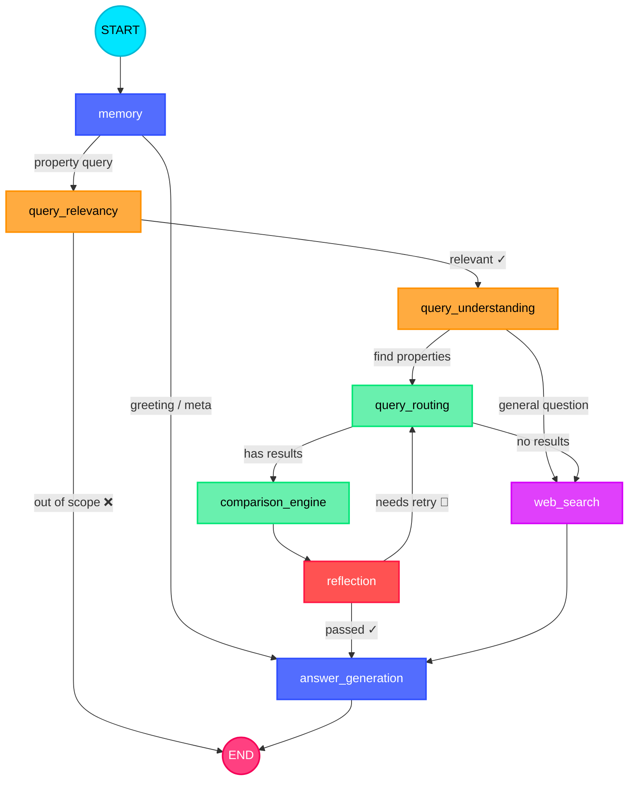

# 🏠 Agentic Property — Dubai Real Estate AI Agent

<p align="center">
  
</p>

<p align="center">
  <b>An 8-node LangGraph agent that answers Dubai real estate questions — routes queries through a dual-path pipeline (property search over 1.5M+ DLD transactions or web search), scores listings against user criteria, audits its own output with a self-correcting retry loop, and streams answers token-by-token through a Streamlit UI.</b>
</p>

<p align="center">
  <a href="#"></a>
  <a href="#"></a>
  <a href="#"></a>
  <a href="#"></a>
  <a href="#"></a>
  <a href="#"></a>
  <a href="#"></a>
  <a href="#"></a>
  <a href="#"></a>
</p>

---

## Architecture



---

## What Makes This Agentic

- **Self-correcting pipeline**: The reflection node audits the comparison engine's output. If it finds hallucinated scores or missing criteria, the graph routes **back** to re-fetch — a true agentic loop, not a linear chain.
- **1.5M+ property transactions** accessible via a custom **MCP server** (Model Context Protocol) with real-time currency conversion (USD/EUR/GBP → AED).
- **Multi-language**: Handles queries in 6 languages (English, Arabic, Chinese, French, Spanish, Russian) — same routing accuracy, same pipeline.
- **Streaming UI**: Every answer appears token-by-token. A collapsible "Thinking" panel exposes route, data source, retries, timing (TTFT), and token count.
- **SQLite → Postgres auto-fallback**: Same code runs locally or in Docker with zero config changes.
- **Prompts in YAML**: Engineering agent behavior without touching Python — iterate prompts independently of code.

## Design Decisions

- **Single state object**: One `AgentState` Pydantic model flows through every node. No hidden channels, fully serializable, checkpointed by SqliteSaver per conversation thread.
- **Memory routing fix**: The memory node runs first, clears stale routing state from prior turns, and classifies queries as greeting/meta/property — preventing a common LangGraph pitfall where prior turn decisions leak into the current turn.
- **Two-tier data fetch**: Active listings first (live data, recommendable). If empty, falls back to historical DLD transactions (insights only). Both accessed via a single MCP server with automatic subprocess management.
- **Fail-safe LLM calls**: Every node has a JSON parse fallback. Relevancy defaults to "allow" on parse failure — never blocks a valid user. Understanding defaults to web_search over hallucinating property results.

## Data Pipeline

The system ingests 28K+ active listings via a **Bayut/RapidAPI scraper** (async, key rotation, 429 handling, auto-dedup) and 1.5M+ historical DLD records. Both live in **SQLite** (local dev) or **PostgreSQL** (Docker) — served by **FastAPI** with 20+ filterable fields (price, area, bedrooms, furnishing, completion status, etc.), wrapped by an **MCP server** (FastMCP, 3 tools) that the LangGraph agent auto-launches as a subprocess. Dataset versioning via **DVC + S3**.

## Project Structure

```
Agentic-Property/
├── main.py                     # Streamlit entry point
├── assets/                     # Architecture SVG banner
├── src/agents/                 # LangGraph graph + state model
├── src/nodes/                  # 8 pipeline nodes (memory → answer_generation)
├── src/mcp/                    # MCP server + persistent client
├── src/data_service/           # FastAPI + SQLAlchemy data service
├── src/prompts/                # YAML prompt templates (7 files)
├── src/llm/factory.py          # Multi-provider LLM abstraction
├── docker/                     # Docker compose stack
├── tests/                      # Pytest suite (unit + integration + E2E)
├── scripts/                    # CLI, scraper, data service, eval runner
└── data/                       # DVC-tracked datasets (active + historical)
```

## Quick Start

```bash
git clone https://github.com/Mahmoud-N-Elmallah/Agentic-Property.git
cd Agentic-Property
cp .env.example .env          # set GROQ_API_KEY, TAVILY_API_KEY, EXCHANGERATE_API_KEY
uv sync                       # install dependencies (uv)
uv run python src/data_service/seed.py  # seed 31K+ records
uv run scripts/run_data_service.py      # launch FastAPI at :8000
uv run streamlit run main.py            # launch agent UI — MCP server auto-starts
```

For Docker: `cd docker && docker-compose up -d`.  
For CLI: `uv run python scripts/run_cli.py "2-bedroom in Marina under 2M AED"`.

## Tests & Evaluation

```bash
uv run pytest tests/ -v                       # 4 test suites (unit, graph, E2E, thread isolation)
uv run python scripts/run_langsmith_eval.py   # 29+ LangSmith test cases across 6 languages
```

## License

MIT — see [LICENSE](LICENSE).
