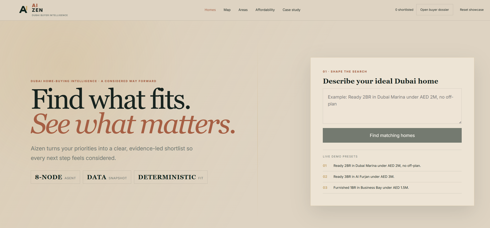
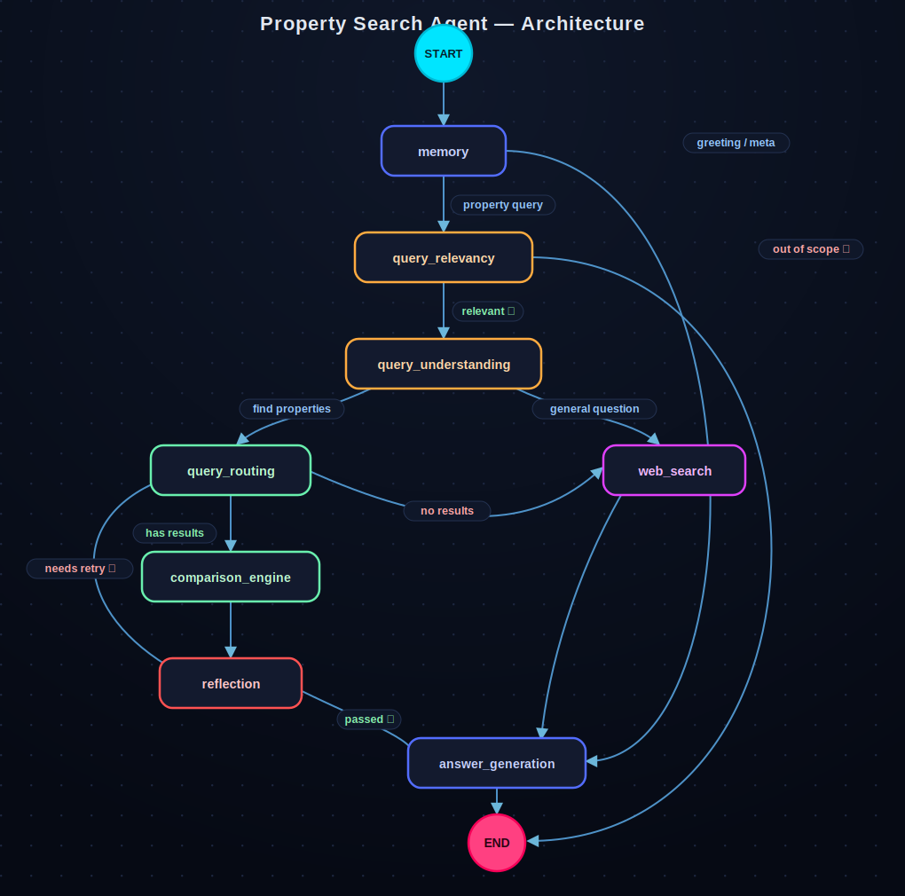

# Aizen

### Find what fits. See what matters.

Aizen is a buyer-first workspace for Dubai property search. Describe the home you want in plain language and Aizen turns it into a validated brief, searches a frozen listing snapshot, and returns a shortlist you can inspect rather than take on faith.

**Search less. Decide better.**



<video src="https://raw.githubusercontent.com/SherifGamal9441/Agentic-Property/main/assets/aizen-demo.mp4" controls width="100%"></video>

## Property search gets messy after the first tab

A buyer rarely has one filter. They have a budget, preferred areas, timing, deal breakers, and several details they care about but may trade away. Listing portals can return matches, but they do not explain which requirements each home satisfies or where the evidence is thin.

Aizen keeps that decision in one place. Try a request such as:

> Ready 2BR in Dubai Marina under AED 2M, no off-plan.

The request becomes a structured `BuyerBrief`. You can correct the interpretation before committing to a search, watch the agent work, then inspect every result against the same brief.

## One search, all the way to a decision

1. **Describe the home.** Start with ordinary language, not a wall of filters.
2. **Check the brief.** Aizen separates must-haves, preferences, and deal breakers before retrieval.
3. **Follow the run.** The browser streams each agent step as the graph searches and audits the snapshot.
4. **Inspect the shortlist.** Every home carries matched criteria, evidence coverage, source links, observation date, and snapshot identity.
5. **Work the decision.** Compare up to four homes, test an affordability scenario, review the map, keep notes, and print a buyer dossier.

The initial submission authorizes the search. Later edits do nothing until you choose **Apply & rerun**, so an accidental change cannot silently alter an active result set.

## The model interprets; code decides

The language model handles scope, brief interpretation, and written guidance. Fit, ranking, fees, arithmetic, and evidence checks stay in deterministic code.

- `BuyerBrief` is validated before retrieval.
- MCP sends typed filters to the listing service.
- The comparison engine evaluates criteria and sorts homes locally.
- Reflection audits IDs, hard rules, arithmetic, sources, and snapshot identity.
- A missing field remains missing. Aizen never turns it into a verified match.

That boundary matters because a persuasive answer is not the same thing as an auditable one.

## How a request moves through Aizen

<p align="center">
  
</p>

Property searches use the eight-node LangGraph workflow shown above. Informational questions take a separate cited web-research branch. The React client owns presentation and browser-local workspace state; FastAPI owns request validation and streaming; MCP keeps property access behind a typed boundary.

## Engineering choices with consequences

- Search uses a dated snapshot, not a claim of live inventory. Every result carries the snapshot identity that produced it.
- Active listings and historical transactions remain separate. Historical rows can provide context but can never fill an empty active search.
- PostgreSQL is the primary store. SQLite remains an explicit service fallback for local resilience.
- Comparison and reflection are deterministic, which makes the same brief and snapshot reproducible.
- Recent searches store validated briefs, not old answers. A rerun executes the graph again.
- MapLibre and OpenFreeMap provide the map without a paid map service, and the map bundle loads only when needed.

The versioned schema-v2 snapshot contains **3,087 active listings** and **28,809 historical transaction rows**, frozen on **2026-07-02**. [Data provenance](docs/data-provenance.md) records the DVC pointers, checksums, schema, and known evidence limits.

## Run the whole project

You need Git, Docker Desktop with Compose, Python 3.13+, [uv](https://docs.astral.sh/uv/), access to the configured DVC remote, and a Groq account. In PowerShell, replace the model name and paste your API key when prompted, then run this single block:

```powershell
$env:LLM_PROVIDER = "groq"
$env:GROQ_MODEL = "<model-available-in-your-groq-account>"
$env:GROQ_API_KEY = Read-Host "Groq API key"
git clone https://github.com/SherifGamal9441/Agentic-Property.git
Set-Location Agentic-Property
uv sync
uv run dvc pull
uv run python scripts/preflight.py
docker compose up --build -d
docker compose ps
Start-Process "http://localhost:5173"
```

Preflight checks provider configuration and reachability, DVC checksums, Compose, service health, and ports before startup. The stack runs the React frontend, agent API, data service, and PostgreSQL. SQLite remains available if the primary database cannot connect.

Ollama, vLLM, and other OpenAI-compatible endpoints are also supported. Their variables are documented in [`.env.example`](.env.example). If startup fails, use the [troubleshooting guide](docs/troubleshooting.md).

After startup, `docker compose logs -f agent-api` follows an agent run and `docker compose down` stops the stack.

## Release check

The 2026-07-15 release passed 75 Python tests, 13 React/Vitest tests, 9 Chromium journeys, the production build, the four-service Compose health check, and snapshot/provider preflight. The agent runs on a locally served Qwen3.6-35B-A3B model, with vLLM and llama.cpp used as serving runtimes; LangSmith evaluations exercised that same setup. Three live-provider rehearsals ran against `active-2026-07-02-v1` without replaying cached answers. See the [evaluation record](docs/evaluation.md) for the evidence.

## Read the deeper case study

- [Architecture](docs/architecture.md)
- [Scoring and evidence](docs/scoring-and-evidence.md)
- [Data provenance](docs/data-provenance.md)
- [Evaluation](docs/evaluation.md)
- [Design system](docs/design-system.md)
- [Architecture decisions](docs/decisions/)
- [Demo runbook](docs/demo-runbook.md)

## License

MIT. See [LICENSE](LICENSE).
