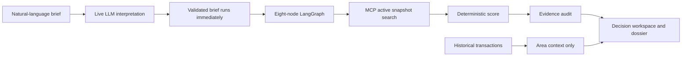

# Aizen

**Aizen is an evidence-first Dubai home-buying copilot: describe a home once, watch a live eight-node investigation, and receive deterministic, source-audited matches from a frozen listing snapshot.**


## The 60-second demo

1. Choose “Ready 2BR in Dubai Marina under AED 2M, no off-plan.”
2. Select **Find matching homes**; Aizen interprets and immediately runs the validated brief.
3. Meet the completion takeover, review its evidence metrics, and open the best match's evidence profile.
4. Edit and rerun the compact brief, compare up to four homes, enter an affordability scenario, and print the buyer dossier.

## Why it is technically credible

- A validated `BuyerBrief` separates model interpretation from search execution; submit authorizes the first run and later edits require **Apply & rerun**.
- `PropertyGuidance` references audited properties and criteria instead of trusting free-form factual prose.
- MCP isolates listing retrieval behind typed filters and preserves provider flexibility.
- Deterministic code—not an LLM—evaluates criteria, weights fit, and audits invariants.
- Active listing evidence and historical transaction context never substitute for one another.
- PostgreSQL is primary; SQLite remains an explicit degraded fallback.
- React loads the heavyweight OpenFreeMap/MapLibre surface only when requested.
- Every shown property exposes its captured source, observation date, snapshot, conflicts, and unknowns.
- Property visuals are deterministic editorial architecture generated from each property's stable identity; no listing photography is implied.



## Verified data and its limits

The frozen schema-v2 snapshot contains **3,087 captured active listings** and **28,809 historical transaction rows**, collected through the existing project source pipeline and frozen on **2026-07-02**. DVC pointers, checksums, field definitions, and validation results are documented in [data provenance](docs/data-provenance.md).

The source did not provide independently verified unit area or dedicated unit parking during the controlled enrichment attempt. Aizen therefore withholds unit size, price per square foot, dedicated parking, and unit-price assessment. Whole-building values remain explicitly `building_*` fields. Historical context uses robust reported-price distributions, not valuation.

## One-command local startup

Prerequisites: Docker Desktop, Git, DVC access to the configured remote, and one configured live LLM provider.

```powershell
Copy-Item .env.example .env
# Edit .env for exactly one provider.
uv sync
uv run dvc pull
uv run python scripts/preflight.py
docker compose up --build -d
```

Open [http://localhost:5173](http://localhost:5173). No model response is cached or replayed; the first run waits for the configured live provider.

## Preset recruiter scenarios

- Ready 2BR in Dubai Marina under AED 2M, no off-plan.
- Ready 3BR in Al Furjan under AED 3M.
- Furnished 1BR in Business Bay under AED 1.5M.

Presets populate the query, then the same one-action path interprets and runs the complete live agent.

## Tests and evaluation

```powershell
uv run pytest -q
Push-Location frontend
npm run test:gate
npm run build
npm run test:e2e
Pop-Location
docker compose config --quiet
git diff --check
```

Verified release results and manual gates belong in [evaluation](docs/evaluation.md); the in-product `#/case-study` route tells the recruiter story without hard-coding stale counts.

## Documentation

- [Architecture](docs/architecture.md)
- [Data provenance](docs/data-provenance.md)
- [Scoring and evidence](docs/scoring-and-evidence.md)
- [Evaluation](docs/evaluation.md)
- [Demo runbook](docs/demo-runbook.md)
- [Troubleshooting](docs/troubleshooting.md)
- [Design system](docs/design-system.md)
- [Active specification](specs/006-aizen-flagship-remaster/spec.md)
- [Architecture decisions](docs/decisions/)

## Known limitations

Local Docker demo only; English only; no accounts or cross-device sync; external source links may expire; property visuals are abstract rather than listing photography; no verified unit-size fields; web research depends on external sources; affordability is a buyer-entered scenario, not financial advice; historical prices are context, not current inventory or valuation.

## License

MIT — see [LICENSE](LICENSE). Existing team attribution is retained there.
