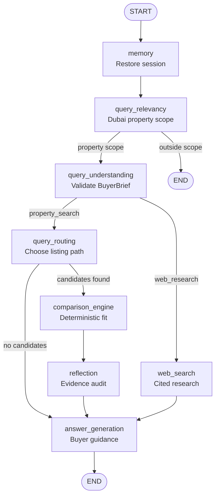
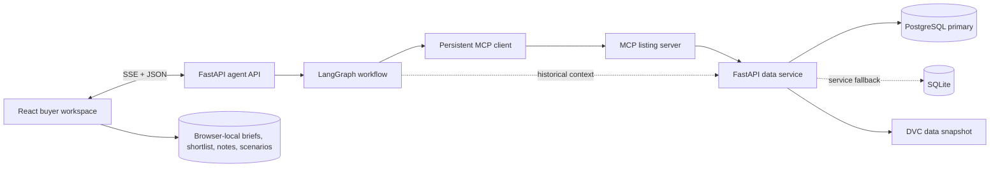

# Aizen

Aizen is a Dubai home-buying workspace. It turns a request in plain language into a shortlist you can inspect, compare, and act on.

Try something like: `Ready 2BR in Dubai Marina under AED 2M, no off-plan.`


## What you get

1. Aizen turns the request into a validated `BuyerBrief` before it searches.
2. The agent searches the active listing snapshot and streams its progress in the browser.
3. Each result shows its matched criteria, evidence coverage, source, observation date, and snapshot identity.
4. You can compare up to four homes, check an affordability scenario, open the map, and print a buyer dossier.

The search brief stays in your control. The first submission authorizes a run; later edits use **Apply & rerun**.

## Where the model stops

The model handles scope, brief interpretation, and written guidance. It does not calculate fit, fees, valuation, or market benchmarks. Those decisions stay in code.

- `BuyerBrief` is validated before retrieval.
- MCP passes typed filters to the listing service.
- The comparison engine evaluates criteria and ranks homes locally.
- Reflection checks IDs, hard rules, arithmetic, sources, and snapshot identity.
- Missing data never becomes a verified match.

## The search path



Property searches follow the eight-node LangGraph path above. Questions about laws, areas, or the wider market use a separate web-search route with citations.

## How the pieces fit



The browser owns presentation and private workspace state. The agent API validates requests and streams progress. MCP keeps listing retrieval behind a typed boundary. PostgreSQL is primary, with SQLite as the local fallback.

## The data

The versioned schema-v2 snapshot contains 3,087 active listings and 28,809 historical transaction rows, collected on 2026-07-02. Active listings and historical transactions stay separate, so historical context cannot quietly become a current listing result.

See [data provenance](docs/data-provenance.md) for DVC pointers, checksums, field definitions, and validation results.

## Run it locally

### Prerequisites

- Docker Desktop with Compose
- Git
- Python 3.13 or later and [uv](https://docs.astral.sh/uv/getting-started/installation/)
- Access to the DVC remote configured in `.dvc/config`
- One live LLM provider

### 1. Get the code

```bash
git clone https://github.com/SherifGamal9441/Agentic-Property.git
cd Agentic-Property
uv sync
```

### 2. Create the environment file

PowerShell:

```powershell
Copy-Item .env.example .env
```

macOS or Linux:

```bash
cp .env.example .env
```

### 3. Configure one LLM provider

Edit `.env` and choose exactly one provider. The application validates the selected provider before startup.

For the simplest hosted setup, use Groq:

```dotenv
LLM_PROVIDER=groq
GROQ_MODEL=<model available in your Groq account>
GROQ_API_KEY=<your Groq API key>
```

For a local model served by Ollama:

```bash
ollama serve
ollama pull <your-model>
```

```dotenv
LLM_PROVIDER=ollama
OLLAMA_MODEL=<your-model>
OLLAMA_BASE_URL=http://host.docker.internal:11434
```

For vLLM:

```dotenv
LLM_PROVIDER=vllm
VLLM_MODEL=<your-model>
VLLM_BASE_URL=http://host.docker.internal:8888/v1
VLLM_API_KEY=<your-vllm-key-or-not-needed>
```

For another OpenAI-compatible endpoint:

```dotenv
LLM_PROVIDER=custom_openai_compatible_endpoint
CUSTOM_OPENAI_MODEL=<your-model>
CUSTOM_OPENAI_BASE_URL=https://your-endpoint.example/v1
OPENAI_API_KEY=<your-api-key>
```

`TAVILY_API_KEY` and `EXCHANGERATE_API_KEY` are optional. They enable web research and currency conversion. LangSmith tracing is also optional:

```dotenv
LANGSMITH_TRACING=true
LANGSMITH_API_KEY=<your LangSmith API key>
LANGSMITH_PROJECT=agentic-property
```

### 4. Pull the data and run preflight

```bash
uv run dvc pull
uv run python scripts/preflight.py
```

Preflight checks the selected provider, provider reachability, DVC checksums, Compose configuration, service health, and required ports. If the DVC remote requests credentials, configure them before running `dvc pull`.

### 5. Start the application

```bash
docker compose up --build -d
docker compose ps
```

The stack exposes the frontend at port `5173`, the data service at `8000`, and the agent API at `8002`. Open [http://localhost:5173](http://localhost:5173) when the services report healthy.

To follow agent logs:

```bash
docker compose logs -f agent-api
```

To stop the stack:

```bash
docker compose down
```

Once the app is open, try one of these searches:

- Ready 2BR in Dubai Marina under AED 2M, no off-plan.
- Ready 3BR in Al Furjan under AED 3M.
- Furnished 1BR in Business Bay under AED 1.5M.

## Checks

The current release record includes 75 Python tests, 13 React/Vitest tests, 9 Chromium journeys, a passing production build, a healthy Compose stack, and a passing data preflight. See the full [evaluation record](docs/evaluation.md) for the release gates, live-provider rehearsal, and manual acceptance checks.

### LangSmith snapshot

Experiment #3, `structural-4121c378`:

| Feedback metric | Average |
| --- | ---: |
| `data_intent` | 0.92 |
| `data_source` | 0.92 |
| `is_relevant` | 1.00 |
| `parsed_query` | 0.91 |
| `rejection` | 0.85 |

## More detail

- [Architecture](docs/architecture.md)
- [Data provenance](docs/data-provenance.md)
- [Scoring and evidence](docs/scoring-and-evidence.md)
- [Evaluation](docs/evaluation.md)
- [Demo runbook](docs/demo-runbook.md)
- [Troubleshooting](docs/troubleshooting.md)
- [Design system](docs/design-system.md)
- [Architecture decisions](docs/decisions/)

## License

MIT. See [LICENSE](LICENSE).
