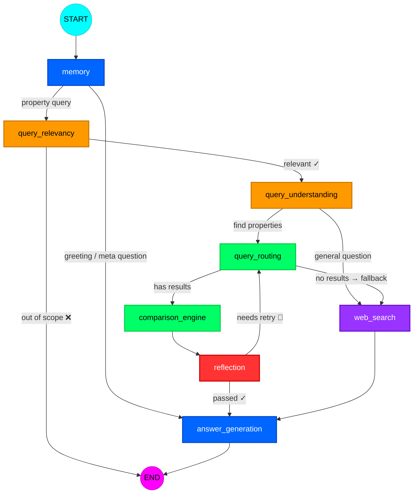
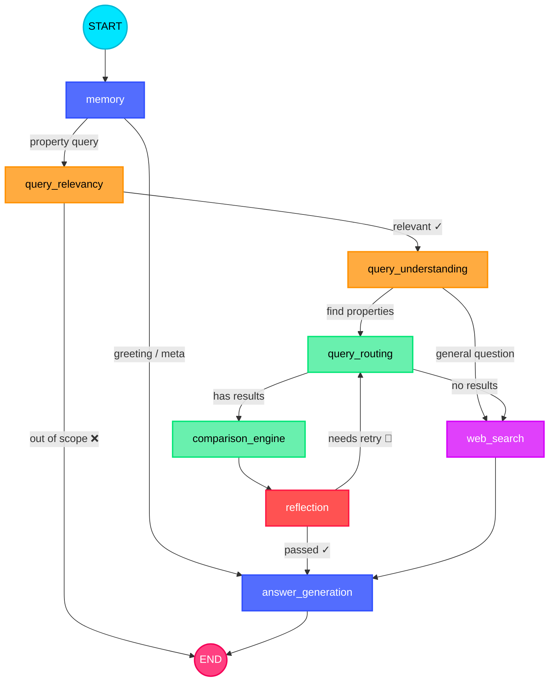

# 🏠 Agentic Property — Dubai Real Estate AI Agent

<p align="center">
  <b>A LangGraph-powered agentic RAG system for Dubai real estate — property recommendations, market insights, and conversational search backed by 1.5M+ DLD transactions and live listings.</b>
</p>

<p align="center">
  <a href="#-architecture"></a>
  <a href="#-tech-stack"></a>
  <a href="#-tech-stack"></a>
  <a href="https://github.com/Mahmoud-N-Elmallah/Agentic-Property/actions"></a>
  <a href="https://github.com/Mahmoud-N-Elmallah/Agentic-Property/blob/main/LICENSE"></a>
</p>

---

## Architecture

The agent is an 8-node **LangGraph StateGraph** with dual-path routing, retry loop, web search fallback, and MCP-powered property data access. Every query flows through a pipeline of LLM-powered nodes, each with a single responsibility.



> For an **interactive version** with zoom, pan, and clickable node descriptions, open **[architecture.html](architecture.html)** in your browser.

### Graph Topology (Text View)

```
START
  │
  ▼
memory ───────────────────────────────────────────────┐
  │ (property query)                                  │ (greeting / meta)
  ▼                                                   │
query_relevancy ──❌ out of scope──► END              │
  │ ✓                                                 │
  ▼                                                   │
query_understanding                                   │
  ├── "query_routing" ──► query_routing               │
  │                         ├── has results           │
  │                         │    ▼                    │
  │                         │  comparison_engine      │
  │                         │    ▼                    │
  │                         │  reflection             │
  │                         │    ├── passed ✓ ────────┤
  │                         │    └── retry 🔄 ────────┘ (back to query_routing)
  │                         │                         │
  │                         └── no results ──┐        │
  │                                          │        │
  └── "web_search" ──► web_search ◄─────────┘         │
                            │                         │
                            ▼                         │
                     answer_generation ◄──────────────┘
                            │
                            ▼
                           END
```

---

## Node-by-Node Breakdown

| # | Node | Color | Role | Key Logic |
|---|------|-------|------|-----------|
| 1 | **Memory** | 🔵 Blue | Entry gate | Builds conversation context from chat history. Classifies every query as `greeting`, `meta_question`, or `property_query`. Short-circuits greetings directly to answer generation — no LLM calls wasted on pipeline nodes. |
| 2 | **Query Relevancy** | 🟠 Orange | Scope gate | Two hard checks: (1) Is it about Dubai? (2) Is it about real estate? Rejects out-of-scope queries immediately. Fail-safe: defaults to `allow` on parse failure (don't block valid users). |
| 3 | **Query Understanding** | 🟠 Orange | Intent parser | Single LLM call does double duty: (1) Extracts structured criteria (location, budget, bedrooms, currency, property type...), (2) Decides route — property search vs general web Q&A. Handles thinking model `<｜end▁of▁thinking｜>

<｜｜DSML｜｜tool_calls>
<｜｜DSML｜｜invoke name="write_file">
<｜｜DSML｜｜parameter name="content" string="true"># 🏠 Agentic Property — Dubai Real Estate AI Agent

<p align="center">
  <b>A LangGraph-powered agentic RAG system for Dubai real estate — property recommendations, market insights, and conversational search backed by 1.5M+ DLD transactions and live listings.</b>
</p>

<p align="center">
  <a href="#-architecture"></a>
  <a href="#-tech-stack"></a>
  <a href="#-tech-stack"></a>
  <a href="#-evaluation"></a>
  <a href="https://github.com/Mahmoud-N-Elmallah/Agentic-Property/blob/main/LICENSE"></a>
</p>

---

## Architecture

The agent is an 8-node **LangGraph StateGraph** with dual-path routing, a retry loop, web search fallback, and MCP-powered property data access. Every query flows through a pipeline of LLM-powered nodes, each with a single responsibility.



> For an **interactive version** with zoom, pan, and clickable node descriptions, open **[architecture.html](architecture.html)** in your browser.

### Pipeline Flow

```
START
  │
  ▼
memory ────────────────────────────────────────┐
  │ (property query)                           │ (greeting / meta)
  ▼                                            │
query_relevancy ──❌ out of scope──► END       │
  │ ✓                                          │
  ▼                                            │
query_understanding                            │
  ├── "query_routing" ──► query_routing        │
  │                         ├── has results    │
  │                         │    ▼             │
  │                         │  comparison      │
  │                         │    ▼             │
  │                         │  reflection      │
  │                         │    ├── ✓ ────────┤
  │                         │    └── 🔄 ───────┘ (back to query_routing)
  │                         │                  │
  │                         └── no results ─┐  │
  │                                         │  │
  └── "web_search" ──► web_search ◄────────┘  │
                            │                  │
                            ▼                  │
                     answer_generation ◄───────┘
                            │
                            ▼
                           END
```

---

## Node-by-Node Breakdown

| # | Node | Color | What It Does |
|---|------|-------|-------------|
| 1 | **Memory** | 🔵 Blue | Entry gate. Builds conversation context from chat history. Classifies every query as `greeting`, `meta_question`, or `property_query`. Greetings short-circuit directly to answer generation — zero LLM calls wasted on the property pipeline. |
| 2 | **Query Relevancy** | 🟠 Orange | Scope gate. Two hard checks: (1) Is it about Dubai? (2) Is it about real estate? Rejects out-of-scope queries immediately with a warm explanation. Fail-safe: defaults to "allow" if LLM output is unparseable — never blocks a valid user. |
| 3 | **Query Understanding** | 🟠 Orange | Intent parser. Single LLM call does double duty: extracts structured criteria (location, budget, bedrooms, property type, currency...), AND decides the route — property search vs general web Q&A. Handles thinking-model output (strips `<think>` tags), retries on empty responses. |
| 4 | **Query Routing** | 🟢 Green | Data fetcher. Connects to the DLD MCP server. Two-tier strategy: **Tier 1** — active listings (live, recommendable). **Tier 2** — historical transactions (insights only, properties may be sold). Converts non-AED currencies before querying the DB. Falls back to web search when both tiers return empty. |
| 5 | **Web Search** | 🟣 Purple | Sub-graph. Three internal nodes: query rewriting → DuckDuckGo search (with Tavily fallback) → LLM summarization. Used both as a primary path for general questions AND as a fallback when no properties match. |
| 6 | **Comparison Engine** | 🟢 Green | Property scorer. Evaluates every retrieved property against user criteria. Outputs per-property: `fit_score` (0.0–1.0), matched/unmatched criteria, and `price_assessment` (below_market / fair / above_market). Caps at 5 properties for small-model reliability. Operates in insights-only mode when data is historical. |
| 7 | **Reflection** | 🔴 Red | Quality auditor. Audits the comparison engine's output — NOT the raw data, NOT user intent. Asks: "Is this comparison accurate, complete, and internally consistent?" If audit fails and retries remain (default: 3), routes BACK to query_routing to try the next tool tier. |
| 8 | **Answer Generation** | 🔵 Blue | Convergence point. Single node for ALL paths. Inspects state and generates the right response: property recommendations (with fit scores and reasoning), market insights (price ranges, trends), general Q&A answers, or warm greetings. The Streamlit UI and CLI always read `final_answer` — one field, every path. |

---

## Key Engineering Decisions

### 1. Single State Object — No Side Channels

All state flows through a single `AgentState` Pydantic model. No hidden globals, no side-band communication between nodes. Every node reads from and writes to the same typed state. This makes the graph fully serializable, debug-friendly, and checkpointable by LangGraph's SqliteSaver.

### 2. Dual-Path Topology

The graph splits after query understanding into two independent paths that converge at answer generation:

- **Property search path**: `query_routing → comparison_engine → reflection → answer_generation` — for users who want specific property recommendations.
- **Web search path**: `web_search → answer_generation` — for general questions about Dubai real estate.

The retry loop (`reflection → query_routing`) only exists on the property path. Web search is a one-shot operation.

### 3. Memory: The "Everything" Conversation Problem — Solved

The original naive approach dumped all conversation history into every LLM prompt. This broke in two ways:

- **Context window** bloat: 20-turn conversations overwhelmed small models (4B–8B params).
- **Routing leak**: the LangGraph router would see stale `route` values from prior turns and short-circuit incorrectly.

**The fix**: The **Memory node** now runs FIRST in every turn and does three things:

1. **Truncates** conversation history to the last 10 turns (configurable).
2. **Classifies** the query as `greeting`, `meta_question`, or `property_query` — greetings skip the entire pipeline.
3. **Clears** `route = None` for property queries so stale routing decisions from prior turns can never leak into the current turn's conditional edges.

```python
# The critical fix in memory.py:76-78
# Route is always set fresh — never inherited from prior state
if category == "greeting":
    return {"conversation_context": context, "route": "memory_greeting"}
if category == "meta_question":
    return {"conversation_context": context, "route": "memory_direct"}
return {"conversation_context": context, "route": None}  # ← clears stale route
```

### 4. Retry Loop with Reflection

Most agent pipelines are linear: fetch → compare → answer. This one has a **self-correcting loop**. If the reflection node finds the comparison low-quality (hallucinated fit scores, missing criteria, inconsistent assessments), it routes back to query_routing to re-fetch with the next tool tier. Retry count is capped at `max_retries` (default 3).

### 5. Fail-Safe Everywhere

Every LLM call has a JSON parse fallback. Every node has a safe default:

| Node | Fallback on failure |
|------|-------------------|
| Memory | Defaults to `property_query` — let it through |
| Query Relevancy | Defaults to `is_relevant=True` — don't block valid users |
| Query Understanding | Defaults to `web_search` — safer than hallucinating a property search |
| Comparison Engine | Returns empty comparison with `_parse_error` field |
| Reflection | Defaults to `ok=False` with error message — triggers retry |
| Web Search | DuckDuckGo → Tavily fallback with separate API key |

### 6. Currency Conversion Layer

Users can express budgets in any currency (USD, EUR, GBP, EGP, etc.). The query understanding node extracts the currency, and query routing converts prices to AED using real-time exchange rates from exchangerate.host API — all before querying the DLD database. The answer generation node then displays prices in both AED and the user's currency.

### 7. MCP Server for Property Data

The property data access layer is a **standalone MCP (Model Context Protocol) server** with three tools:

- `search_active_listings` — current live properties
- `search_historical_listings` — DLD transaction history
- `convert_currency` — real-time FX conversion

The MCP server talks to a **FastAPI data service** backed by SQLite (local dev) or PostgreSQL (Docker production). The MCP client maintains a persistent background thread + event loop to avoid connection overhead per call.

```
User Query → LangGraph Agent → MCP Client (stdio) → MCP Server (FastMCP) → FastAPI Data Service → SQLite/Postgres
```

### 8. Web Search Sub-Graph

The web search node is itself a compiled LangGraph sub-graph with 3 internal nodes:

1. **Query Rewriter**: Rewrites the user's conversational query into a targeted search string.
2. **Searcher**: Queries DuckDuckGo (primary) with automatic Tavily fallback.
3. **Summarizer**: Condenses raw search results into a coherent answer.

This is the only part of the system not powered by DLD data — it handles questions like "what are the best areas to invest in Dubai?" or "how does Dubai mortgage law work?"

### 9. Multi-Provider LLM Abstraction

The LLM layer is provider-agnostic via `src/llm/factory.py`. Switching providers = changing one env var (`LLM_PROVIDER`):

| Provider | Use Case |
|----------|----------|
| `groq` | Cloud — fast inference, default provider |
| `ollama` | Local dev — llama3.1, no API key needed |
| `vllm` | Production GPU server — OpenAI-compatible API |
| `custom_openai_compatible_endpoint` | Any endpoint (Unsloth Studio, llama.cpp server, etc.) |

The factory handles provider-specific quirks: Groq reasoning tokens hidden during streaming, thinking-model output stripping, etc.

### 10. Streamlit UI with Streaming Tokens

The UI streams agent output **token-by-token** via LangGraph's `astream_events`. Each turn shows:

- **Real-time token output** — the answer appears word-by-word as the LLM generates it.
- **Node traversal log** — each node lights up as the graph executes it.
- **Collapsible "Thinking" panel** — shows the route taken, data source, intent, retries, timing (TTFT + total), and agent logs.

Chat history is persisted via `chat_metadata.json` and LangGraph's SqliteSaver checkpointer. Each chat is an isolated thread with its own UUID `thread_id` — clicking a past chat in the sidebar resumes it from where it left off.

### 11. Data Pipeline

The property data comes from a multi-source pipeline:

1. **Scraper** (`scripts/scraper.py`) — extracts DLD data from public sources.
2. **Seed** (`src/data_service/seed.py`) — populates the SQLite DB from CSV files.
3. **DVC** — version-controlled datasets (`data/active_dld.csv.dvc`), with S3 remote for large files.
4. **FastAPI Data Service** — exposes `/search/active` and `/search/historical` endpoints with flexible filtering (area, price range, bedrooms, property type, furnishing, completion status, etc.).
5. **MCP Server** — wraps the data service as MCP tools consumable by the LangGraph agent.

The filtering engine handles comma-separated LLM output (e.g. `"Apartments, Villa"` → OR query), case-insensitive partial matching, and range filters on all numeric fields.

---

## Tech Stack

| Layer | Technology |
|-------|-----------|
| **Orchestration** | LangGraph (StateGraph + conditional edges + checkpointer) |
| **State** | Pydantic v2 `AgentState` model |
| **LLM** | Multi-provider via `src/llm/factory.py` (Groq, Ollama, vLLM, custom OpenAI-compatible) |
| **Data Access** | MCP (Model Context Protocol) — FastMCP server + stdio client |
| **Data Service** | FastAPI + SQLAlchemy + SQLite/PostgreSQL |
| **Web Search** | DuckDuckGo (`ddgs`) with Tavily fallback |
| **FX Rates** | exchangerate.host API (real-time currency conversion) |
| **UI** | Streamlit — token-by-token streaming, chat persistence, thinking panel |
| **Memory** | LangGraph SqliteSaver / AsyncSqliteSaver (per-thread checkpointing) |
| **Evaluation** | LangSmith (structural assertions + LLM-as-judge quality tests) |
| **Data Versioning** | DVC + S3 remote |
| **Testing** | Pytest + pytest-asyncio |

---

## Project Structure

```
Agentic-Property/
├── main.py                         # Streamlit chat UI
├── architecture.html               # Interactive graph visualization
├── pyproject.toml                  # Dependencies (uv)
├── .env.example                    # Environment template
│
├── config/
│   ├── pydantic/settings.py        # Pydantic Settings (LLM config, max_retries)
│   └── mcp.yaml                    # MCP server host/port/transport
│
├── src/
│   ├── agents/
│   │   ├── graph.py                # LangGraph StateGraph definition (8 nodes)
│   │   └── state.py                # AgentState Pydantic model (~25 fields)
│   │
│   ├── nodes/
│   │   ├── memory.py               # Conversation context + query classification
│   │   ├── query_relevancy.py      # Dubai + property scope gate
│   │   ├── query_understanding.py  # Intent parsing + route decision
│   │   ├── query_routing.py        # DLD property fetcher (active → historical)
│   │   ├── web_search.py           # DuckDuckGo sub-graph (3 internal nodes)
│   │   ├── comparison_engine.py    # Property scoring against user criteria
│   │   ├── reflection.py           # Quality auditor + retry trigger
│   │   └── answer_generation.py    # Final response (5 distinct prompt paths)
│   │
│   ├── llm/factory.py              # Multi-provider LLM abstraction
│   ├── memory/long_term_memory.py  # SqliteSaver + AsyncSqliteSaver
│   ├── mcp/
│   │   ├── server.py               # FastMCP server (3 tools)
│   │   ├── client.py               # Persistent MCP client (background thread + loop)
│   │   └── schemas.py              # Pydantic filter schemas
│   ├── data_service/               # FastAPI property data service
│   │   ├── app.py                  # /search/active + /search/historical endpoints
│   │   ├── database.py             # SQLAlchemy engine + session
│   │   └── seed.py                 # DB population from CSV
│   ├── prompts/                    # YAML prompt templates (8 files)
│   └── utils.py                    # parse_llm_json helper
│
├── tests/
│   ├── agents/                     # Graph + E2E + thread isolation tests
│   └── nodes/                      # Per-node unit tests (6 node files tested)
│
├── scripts/
│   ├── run_cli.py                  # CLI invocation
│   ├── scraper.py                  # DLD data scraper
│   ├── run_data_service.py         # Data service launcher (auto-seeds DB)
│   ├── upload_eval_datasets.py     # LangSmith dataset uploader
│   └── run_langsmith_eval.py       # LangSmith evaluation runner
│
└── data/
    ├── memory/chat_history.db      # LangGraph checkpoint DB (SqliteSaver)
    ├── dld_local.db                # Property data (SQLite)
    ├── active_dld.csv.dvc          # DVC-tracked dataset
    └── eval/                       # Evaluation datasets
```

---

## Quick Start

### 1. Clone & Install

```bash
git clone https://github.com/Mahmoud-N-Elmallah/Agentic-Property.git
cd Agentic-Property

# Install dependencies (requires Python >= 3.13)
uv sync
```

### 2. Configure Environment

```bash
cp .env.example .env
# Edit .env — set at minimum:
#   GROQ_API_KEY=your_groq_key       (for LLM)
#   EXCHANGERATE_API_KEY=your_fx_key (for currency conversion)
#   TAVILY_API_KEY=your_tavily_key   (web search fallback)
#   LLM_PROVIDER=groq                (or ollama / vllm / custom_openai_compatible_endpoint)
```

### 3. Seed the Database

```bash
uv run python src/data_service/seed.py
```

### 4. Launch the Data Service

```bash
uv run scripts/run_data_service.py
```

### 5. Start the MCP Server (in a separate terminal)

```bash
uv run mcp run src/mcp/server.py --transport stdio
```

### 6. Run the Agent

**Streamlit Web UI:**
```bash
uv run streamlit run main.py
```

**CLI Mode:**
```bash
uv run python scripts/run_cli.py "2-bedroom apartment in Dubai Marina under 2M AED"
```

### Docker (Alternative)

```bash
cd docker && docker-compose up -d
# Starts: Postgres + Data Service + MCP Server
```

---

## Running Tests

```bash
# All tests
uv run pytest tests/ -v

# Per-module
uv run pytest tests/nodes/ -v
uv run pytest tests/agents/ -v
```

Tests use `uuid4()` thread_ids to avoid contaminating the checkpoint database between runs.

---

## Evaluation (LangSmith)

Structural assertions and LLM-as-judge quality tests against the dual-path routing:

```bash
# Set LANGSMITH_API_KEY in .env first

# Upload evaluation datasets
uv run python scripts/upload_eval_datasets.py

# Run evaluations
uv run python scripts/run_langsmith_eval.py              # all evals
uv run python scripts/run_langsmith_eval.py --type structural
uv run python scripts/run_langsmith_eval.py --type quality --tag currency
```

---

## Contributing

This is a personal project. If you find it interesting and want to contribute, open an issue or PR. All contributions are welcome.

---

## License

MIT — see [LICENSE](LICENSE).

---

<p align="center">
  <sub>Built with ☕ by <a href="https://github.com/Mahmoud-N-Elmallah">Mahmoud N. El-Mallah</a> — Physics → AI, one RAG pipeline at a time.</sub>
</p>
