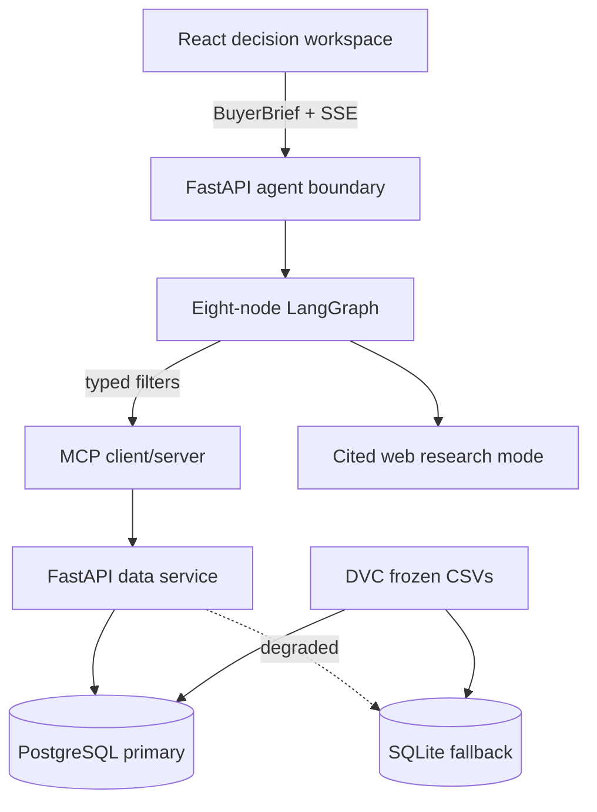

# Architecture

## Runtime boundaries

The browser calls the agent API on port 8002. The agent API owns public validation, SSE sanitation, and conversation restoration. LangGraph owns the eight-node workflow. Property access crosses MCP into the data service on port 8000. PostgreSQL is primary; `src/data_service/database.py` exposes SQLite as a visible degraded fallback. DVC owns frozen CSV delivery.

## Node responsibilities

1. `memory`: bounded, thread-isolated checkpoint context.
2. `query_relevancy`: structured Dubai-property scope gate.
3. `query_understanding`: validates the confirmed brief without changing its values.
4. `query_routing`: translates supported hard criteria and searches the active snapshot once.
5. `web_search`: separate cited informational route.
6. `comparison_engine`: deterministic criterion evaluation and stable sorting.
7. `reflection`: deterministic identity/source/snapshot/arithmetic audit.
8. `answer_generation`: concise explanation of audited facts and gaps.

There is no reflection retry edge. Transport retry, when safe, belongs inside the MCP client and must be bounded.

## Frontend composition

`App.tsx` orchestrates the journey. Public types, SSE, storage, and finance are isolated modules. Code-native brand and case-study surfaces are components. The MapLibre/OpenFreeMap component is dynamically imported so the initial recruiter-facing bundle stays compact.
