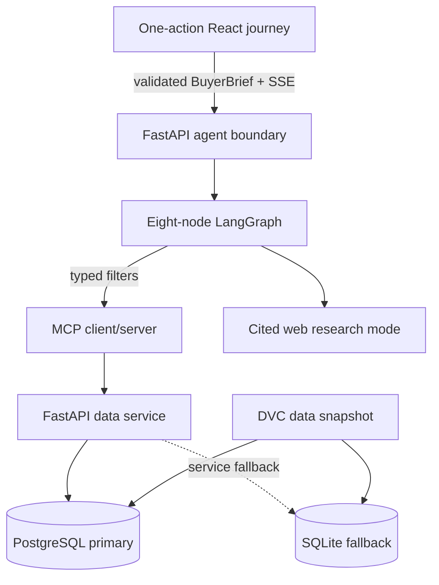

# Architecture

## Runtime boundaries

The browser calls the agent API on port 8002. The agent API owns public validation, SSE sanitation, and conversation restoration. LangGraph owns the eight-node workflow. Property access crosses MCP into the data service on port 8000. PostgreSQL is primary; `src/data_service/database.py` exposes SQLite as an explicit service fallback. DVC owns data-snapshot delivery.

## Node responsibilities

1. `memory`: bounded, thread-isolated checkpoint context.
2. `query_relevancy`: structured Dubai-property scope gate.
3. `query_understanding`: validates the submit-authorized brief without changing its values.
4. `query_routing`: translates supported hard criteria and searches the active snapshot once.
5. `web_search`: separate cited informational route.
6. `comparison_engine`: deterministic criterion evaluation and stable sorting.
7. `reflection`: deterministic identity/source/snapshot/arithmetic audit.
8. `answer_generation`: validated property/criterion guidance references, or cited prose for web research.

There is no reflection retry edge. Transport retry, when safe, belongs inside the MCP client and must be bounded.

## Frontend composition

`App.tsx` orchestrates an abortable `idle → interpreting → running → completed | failed | cancelled` lifecycle. A disposable brief drawer commits changes only through **Apply & rerun**. The run surface transforms in place into the completion view; partial property prose is never shown. Public types, SSE, storage, formatting, and finance remain isolated. The MapLibre/OpenFreeMap component is dynamically imported so the initial browser bundle stays compact.

The comparison workspace accepts one through four audited homes. Its selection is shared with the tray, affordability target, evidence drawer, and dossier. Browser-local recent searches store validated briefs, not prior responses.
